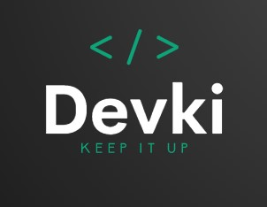

  

<h3 align="center">DEVKI</h3>

  

         Daily coding exercises manager
     
  

### Description

Access to the internet which allows for easy and quick finding of solutions to a given problem and facilitates the
programming process.

Unfortunately, over time, this convenience, along with the accumulation of frameworks and tools that we use when
building applications, may cause a loss of proficiency in quickly solving the most basic tasks (such as complex array
operations). However, it is worth maintaining freshness and the ability to quickly solve these tasks, if only for the
purpose of presenting your skills during a job interview.

A great solution may be to do exercises from the "Codewars" platform. However, personally, I needed an additional tool
that
would allow me to repeat the same tasks every day, so that I could automate solving process of certain problems, or in
other words, gain proficiency.

### Let's started

The app is super easy to use. Tasks are manually added to the `./src/tasks` folder. This could be, for example, a task
from the "Codewars" platform that we have solved, understood, and want to repeat several times in order to solidify the
solution pattern.
___

    yarn generate -amount

Generate in `./daily` random tasks from our task-base (`./src/tasks`). The `-amount` flag indicates amount of generated
tasks (default: 3).
___

    yarn save 

Copy our solitions (`./daily` folder) into `./src/history/DD-MM-YYYY/HH_MM_SS`.
___
For run and test use standard commands like:

    jest ./daily/task1
    ts-node ./daily/1/index.ts

Good luck!